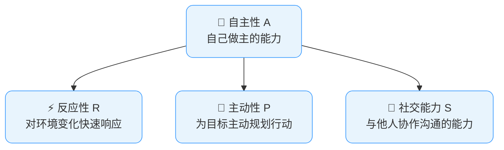
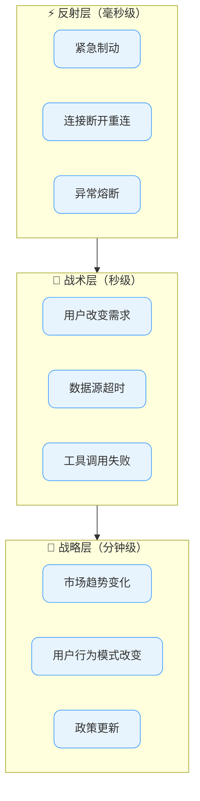
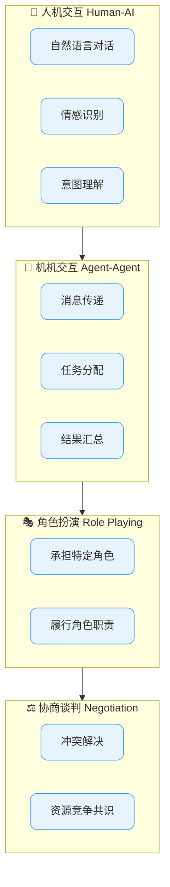
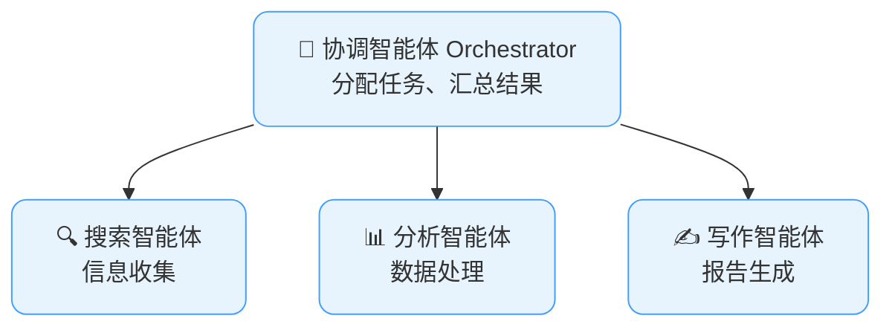

# 智能体核心特征

## 导言

AI智能体区别于普通软件和简单脚本的四个核心特征是：**自主性（Autonomy）、反应性（Reactivity）、主动性（Pro-activeness）、社交能力（Social Ability）**。这四个特征最早由计算机科学家Michael Wooldridge和Nicholas Jennings在1995年提出，至今仍是定义和评估智能体的黄金标准。

这四个特征不是孤立的标签，而是描述了一个智能体从"被动工具"到"主动伙伴"的演化路线。掌握这四个特征，就如同掌握了评估任何AI智能体系统的四把标尺。

Image-Prompt(agent-four-core-features-intro):
```
A flat-design 2D vector illustration showing an evolutionary arrow from left to right. Left side: a gray passive tool icon (hammer) labeled "Passive Tool". Right side: a vibrant tech blue (#409EFF) active partner robot icon with a friendly face labeled "Active Partner". Along the arrow, four milestone markers represent the four core characteristics: Autonomy (A), Reactivity (R), Pro-activeness (P), Social Ability (S), each as a glowing blue checkpoint dot. The arrow transforms from gray to bright blue. Deep blue (#1a1a2e) labels, clean white background, minimalist flat design.
```

## 四大特征全景图



自主性是根，反应性和主动性是两种互补的行为模式（一个向后看、应对变化，一个向前看、追逐目标），而社交能力让智能体突破单打独斗的局限，进入协作的更高层次。

Image-Prompt(four-features-panorama):
```
A flat-design 2D vector illustration showing a hierarchical tree structure. At the root: a large "Autonomy (A)" node as the foundation trunk, colored in tech blue (#409EFF). Branching out from it into three directions: "Reactivity (R)" left branch with a lightning bolt icon (responding to environment), "Pro-activeness (P)" center branch with a forward arrow icon (pursuing goals), and "Social Ability (S)" right branch with two connected nodes icon (collaborating). Direction labels: Reactivity looks backward (left arrow), Pro-activeness looks forward (right arrow). All connected by thin blue lines. Deep blue (#1a1a2e) labels, clean white background, centered symmetrical layout.
```

## 1. 自主性（Autonomy）—— 深度解析

### 定义
自主性是智能体**在没有人类直接干预的情况下，独立做出决策并采取行动**的能力。它是智能体最根本、最具标志性的特征——如果智能体不能自主运作，它就不是"智能体"，而只是一个"工具"。

### 自主性的本质

自主性不等于"完全不受控制"。它更像是一个光谱，从完全被人类操控到完全独立运作之间存在多个层次。

### 自主性的五个等级

| 等级 | 名称 | 描述 | 典型示例 |
|------|------|------|---------|
| L0 | 无自主 | 人类执行所有操作 | 手动在Excel中做数据分析 |
| L1 | 辅助 | 系统提供建议，人类做决定 | ChatGPT给出分析建议，人类操作 |
| L2 | 部分自主 | 系统执行子任务，需要人类确认关键步骤 | 智能体搜索信息但购买前需确认 |
| L3 | 条件自主 | 在预设范围内完全自主 | 智能客服在知识库范围内自主回复 |
| L4 | 高度自主 | 在大多数情况下自主运作，异常时求助 | 自动驾驶在高速公路上自主行驶 |
| L5 | 完全自主 | 在任何情况下都不需要人类干预 | 理论上的通用人工智能（AGI）智能体 |

### 自主性的实现机制

一个具有自主性的智能体，其内部通常包含以下机制：

```python
class AutonomousAgent:
    """
    演示自主性的核心实现要素
    """
    def __init__(self):
        self.goal = None           # 当前目标
        self.state = "idle"        # 当前状态
        self.strategies = []       # 可选策略列表
        self.confidence_threshold = 0.8  # 自主决策的信心阈值

    def decide_and_act(self, environment_state):
        """
        自主决策循环：不等待人类指令，自己判断和执行
        """
        # 1. 评估当前状态与目标的差距
        gap = self.evaluate_gap(environment_state, self.goal)

        # 2. 生成多个可行方案
        options = self.generate_options(gap)

        # 3. 对每个方案评分
        scored_options = [
            (option, self.score_option(option))
            for option in options
        ]

        # 4. 选择最优方案
        best_option, confidence = max(scored_options, key=lambda x: x[1])

        # 5. 关键判断：信心够高就自己做，不够就去问人
        if confidence >= self.confidence_threshold:
            return self.execute(best_option)   # 自主执行
        else:
            return self.ask_human(best_option)  # 人在回路
```

### 自主性的实际范例

假设一个数据看板智能体：

**低自主性（L1）的表现：**
```
智能体：我发现销售额下降了5%。要我帮你生成分析报告吗？
用户：好的，请生成。
智能体：报告已生成。要我发邮件给销售总监吗？
用户：好的，请发送。
—— 每走一步都要问，本质是语音操作的命令行
```

**高自主性（L4）的表现：**
```
智能体：[自动检测] 销售额连续3天下降，下降幅度达到8%。
智能体：[自主行动] 自动分析下降原因 → 发现竞品降价活动 →
        生成分析报告 → 发送给销售总监，附带建议方案 →
        在团队群里发出预警。
智能体：[主动汇报] "销售总监您好，我监测到销售额下降，
        已分析原因是竞品X的降价活动，详细报告见附件。
        建议方案：1.限时匹配价格 2.买赠活动。
        我已通知市场团队准备方案，请您审阅。"
—— 从发现问题到采取行动到报告结果的完整链条，不需要人类中间插手
```

### 自主性设计中的常见陷阱

| 陷阱 | 说明 | 解决方案 |
|------|------|---------|
| 过度自主 | 智能体做出了不该自己做的决定（如擅自发送客户邮件） | 设置操作分级，高风险操作必须人工确认 |
| 自主不足 | 每个小决定都要问人，反而增加了人类的工作量 | 设定自主决策范围，边界内的事项自动处理 |
| 自主漂移 | 智能体的行为逐渐偏离原始目标 | 设置定期对齐检查点和目标约束条件 |
| 信息不足下的自主 | 在缺乏关键信息时强行做决定 | 设定"不确定即求助"机制，降低自主的信心阈值 |

Image-Prompt(agent-autonomy-spectrum):
```
A flat-design 2D vector illustration showing a horizontal autonomy level spectrum from left (L0) to right (L5). L0: a human puppet-controlling a robot with strings (No Autonomy). L1: a human pointing while a robot watches (Assisted). L2: robot doing a task while human checks a clipboard (Partial Autonomy). L3: robot working within a fenced area (Conditional Autonomy). L4: robot driving on a highway while human reads (High Autonomy). L5: robot working independently with a star glow (Full Autonomy). Each level is a rounded card, progressively colored from gray to tech blue (#409EFF). A confidence threshold gauge is shown at the bottom. Deep blue (#1a1a2e) labels, clean white background, centered symmetrical layout.
```

## 2. 反应性（Reactivity）—— 深度解析

### 定义
反应性是智能体**感知环境中的变化并及时做出适当响应**的能力。如果说自主性回答的是"要不要自己做"，反应性回答的是"面对变化时能不能及时反应"。

### 反应性的关键指标

```
反应性的质量 = 检测速度 × 响应适当性 × 动作时效性
```

- **检测速度**：从环境变化发生到智能体感知到的间隔
- **响应适当性**：采取的响应动作是否恰到好处，不多不少
- **动作时效性**：从感知到完成响应的总时间是否在可接受范围内

### 反应性的层次模型



### 反应性场景深度演示

**场景：自动化股票交易智能体**

```python
# 演示不同反应层次的行为
class TradingAgent:
    def react(self, market_event):
        if market_event.type == "FLASH_CRASH":
            # 反射层反应：立即止损，毫秒级
            return self.emergency_liquidate()

        elif market_event.type == "PRICE_BREAKOUT":
            # 战术层反应：分析突破是否确认，秒级
            if self.confirm_breakout(market_event):
                return self.adjust_position(market_event)

        elif market_event.type == "POLICY_CHANGE":
            # 战略层反应：重新评估策略，分钟级
            return self.reevaluate_strategy(market_event)
```

**为什么反应性如此重要？** 想象一个客服智能体，用户正在投诉产品质量问题，情绪激动。如果智能体反应延迟了10秒才回复，用户可能已经关闭对话窗口并决定再也不买这个品牌的产品了。在真实世界的交互中，**时机就是一切**。

### 反应性与稳定性的平衡

过度反应和反应不足一样糟糕：

| 问题 | 表现 | 后果 |
|------|------|------|
| 过度反应 | 任何小变化都触发大动作 | 系统振荡、用户体验差、资源浪费 |
| 反应不足 | 重大变化被忽视或延迟处理 | 错失机会、问题恶化、不可挽回的损失 |
| 错误反应 | 对变化做出了不恰当的响应 | 可能在火上浇油，让问题更糟 |

**平衡策略**：使用"变化重要性评估器"对每个环境变化打分，只在分数超过阈值时才触发响应，响应力度与重要性成正比。

Image-Prompt(agent-reactivity-layers):
```
A flat-design 2D vector illustration showing three concentric or layered circles representing reactivity levels. Innermost circle (Reflex Layer, millisecond): a lightning bolt icon with emergency brake and circuit breaker symbols. Middle circle (Tactical Layer, seconds): a gear with adjustment knob icon, tools changing, user demand shifts. Outermost circle (Strategic Layer, minutes): a compass and trend chart icon, market trend changes, policy updates. Each layer is progressively larger and lighter in tech blue (#409EFF) opacity. A small balance scale at the bottom compares "Over-reaction" (oscillating waveform) vs "Under-reaction" (flat line), with the ideal as a smooth moderate curve in the middle. Deep blue (#1a1a2e) labels, clean white background, centered layout.
```

## 3. 主动性（Pro-activeness）—— 深度解析

### 定义
主动性是智能体**不只是对发生的事情做出反应，而是主动采取行动以实现长期目标**的能力。这是区分"工具"和"伙伴"的关键特征。

### 主动 vs 被动：根本差异

```
被动模式（工具思维）：
  等待指令 → 执行指令 → 等待下一条指令 → ...

主动模式（伙伴思维）：
  理解目标 → 预见需求 → 主动规划 → 提前行动 → 汇报进展 → ...
```

### 主动性的表现维度

#### 3.1 目标驱动的主动

智能体不只是执行命令，而是主动推进目标的实现：

```
场景：你的目标是在月底前完成季度报告

被动智能体：
  Day 1-29：什么都不做
  Day 30（你提醒）："季度报告该写了" → 开始工作

主动智能体：
  Day 1：在日历中标记截止日期
  Day 15：提醒你收集数据（"报告还差两个部门的数据"）
  Day 20：整理草稿并发给你预览
  Day 25：根据你的反馈修改
  Day 28：生成最终版并建议发送对象
```

#### 3.2 预判式的主动

智能体根据模式识别提前预判需求：

```
场景：你是销售经理，每月初要做上个月的业绩分析

主动智能体：
  每月28日：自动收集当月销售数据
  每月1日凌晨：自动生成上月业绩分析报告
  每月1日早8点：报告已在你邮箱，附带AI发现的3个关键趋势

你在上班路上就能看到报告，而不需要到达办公室后手动提取数据。
```

#### 3.3 机会发现式的主动

智能体不仅仅处理被告知的事情，还主动发现机会：

```
场景：电商运营智能体

主动行为：
  - 发现某商品在社交媒体上被网红推荐 → 主动建议增加库存
  - 检测到某商品的好评率从4.8降到4.2 → 主动分析差评原因
  - 发现竞品A的某款产品断货 → 主动建议推广你的同类产品
  - 识别出复购率高的用户群体特征 → 主动建议针对该群体的营销策略
```

### 主动性实现的技术框架

```python
class ProactiveAgent:
    """
    展示主动性的核心技术组件
    """
    def __init__(self):
        self.goals = []              # 长期目标列表
        self.monitors = []           # 持续监控的任务
        self.scheduled_actions = []  # 周期性主动任务
        self.opportunity_detectors = []  # 机会发现器

    def proactive_loop(self):
        """主动循环：不等指令，自己找事做"""
        while True:
            # 1. 检查周期性任务是否到期
            for action in self.scheduled_actions:
                if action.is_due():
                    self.execute(action)

            # 2. 检查监控项是否有异常
            for monitor in self.monitors:
                anomaly = monitor.check()
                if anomaly:
                    self.report_and_act(anomaly)

            # 3. 扫描机会
            for detector in self.opportunity_detectors:
                opportunity = detector.scan()
                if opportunity and opportunity.score > 0.7:
                    self.suggest(opportunity)

            # 4. 推进长期目标
            for goal in self.goals:
                next_step = self.plan_next_step(goal)
                if next_step.is_ready():
                    self.execute(next_step)

            time.sleep(60)  # 每分钟检查一次
```

### 主动性的边界——什么时候不该主动？

| 应该主动 | 不应该主动 |
|---------|-----------|
| 可逆的低风险操作（如数据收集、分析建议） | 不可逆的高风险操作（如发送真实邮件、发布内容） |
| 用户已授权范围内的例行事务 | 未经用户授权的个人信息处理 |
| 紧急且用户期望及时获知的事项 | 用户明确要求"不要打扰"时的非紧急事项 |
| 减少用户重复劳动的事项 | 用户享受手动完成的事项 |

Image-Prompt(agent-proactiveness-concept):
```
A flat-design 2D vector illustration showing a contrast between two modes. Left half: a "Reactive" robot sitting idle at a desk, waiting for a bell/notification to ring before moving — labeled "Passive: Wait for command". Right half: a "Proactive" robot actively working at a calendar desk, with multiple initiative actions: marking dates on a calendar, preparing reports in advance, sending alerts, discovering opportunities with a magnifying glass — labeled "Proactive: Anticipate & Act". A time horizon arrow at the bottom shows the proactive robot working ahead of deadlines (Day 1, Day 15, Day 20, Day 28). Tech blue (#409EFF) for the proactive side, muted gray for the passive side. Deep blue (#1a1a2e) labels, clean white background, split symmetrical layout.
```

## 4. 社交能力（Social Ability）—— 深度解析

### 定义
社交能力是智能体**与其他智能体以及人类进行有意义的交互和协作**的能力。在日益复杂的任务场景中，单个智能体往往无法完成所有工作，社交能力让多个智能体能够像一个团队一样协作。

### 社交能力的四个层面



### 4.1 人机交互

这是最基础的社交能力。一个好的智能体应该：

```
用户："我感觉最近工作效率有点低..."

差的交互：
智能体："我理解。建议您使用番茄工作法。"

好的交互：
智能体："我理解这种感觉。让我帮您分析一下——我查看了您这一周的日历，
发现您平均每天有4.2小时的会议，而且大多数会议穿插在上午和下午之间，
导致您很少有连续2小时以上的专注时间。
要不要我帮您重新安排一下下周的会议，尽量集中在下午，
给您留出整个上午的深度工作时间？"
```

好的社交交互展示了三个关键品质：
1. **共情**：理解用户的情感状态
2. **数据支撑**：用具体数据说明问题
3. **行动导向**：不只是给建议，而是主动提出可执行的方案

### 4.2 多智能体协作

当任务复杂到单个智能体难以独立完成时，多智能体协作就派上了用场。

**典型的多智能体协作模式：**



**多智能体协作的代码示例（基于CrewAI的概念）：**

```python
# 定义三个专业智能体
researcher = Agent(
    role="市场研究员",
    goal="收集目标市场的最新数据",
    backstory="你是一位经验丰富的市场研究专家",
    tools=[search_tool, data_scraper]
)

analyst = Agent(
    role="数据分析师",
    goal="对收集到的数据进行深度分析",
    backstory="你擅长从数据中发现隐藏的模式和趋势",
    tools=[python_executor, chart_generator]
)

writer = Agent(
    role="报告撰写师",
    goal="将分析结果整理成专业的市场报告",
    backstory="你是一位能将复杂数据转化为清晰洞见的写作者",
    tools=[document_editor, pdf_generator]
)

# 定义协作任务流程
crew = Crew(
    agents=[researcher, analyst, writer],
    tasks=[
        Task("收集2025年Q2新能源汽车市场数据", agent=researcher),
        Task("分析市场份额变化和增长趋势", agent=analyst),
        Task("撰写完整的市场分析报告", agent=writer)
    ],
    process=Process.sequential  # 按顺序协作
)

result = crew.kickoff()
```

### 4.3 角色扮演

在多智能体系统中，每个智能体需要扮演特定的角色。这不仅仅是功能的划分，还包括行为方式、专业术语和决策偏好。

| 角色 | 核心能力 | 行为风格 | 典型工具 |
|------|---------|---------|---------|
| 研究员 | 信息检索和整理 | 严谨、全面、注重来源 | 搜索引擎、爬虫 |
| 分析师 | 数据处理和洞察 | 逻辑严密、量化导向 | Python、SQL、Excel |
| 创意师 | 创意生成和发散思维 | 开放、联想、不拘一格 | 画布工具、思维导图 |
| 执行者 | 精准执行和跟进 | 务实、守时、注重细节 | 项目管理工具、日历 |
| 协调者 | 任务分配和进度管理 | 全局视角、善于沟通 | 任务管理、消息系统 |
| 评论者 | 质疑和挑刺 | 批判性思维、关注风险 | 检查清单、测试工具 |

### 4.4 协商谈判

当多个智能体有不同优先级或资源有限时，协商能力就至关重要了。

**一个简化的协商场景：**

```
场景：两个智能体都需要使用同一个数据分析服务器

智能体A（紧急任务）：我需要服务器分析今天的销售数据，10分钟内就要出结果给CEO。

智能体B（常规任务）：我在跑月度财务报表，还需要30分钟。

协商过程：
智能体A：我的任务优先级是Critical，目标受众是CEO。
智能体B：明白。我可以暂停我的任务，但需要5分钟保存中间结果。
智能体A：可以，5分钟后我接手。
智能体B：[保存进度] 已释放资源，你请用。
智能体A：[接管服务器] 感谢配合。我的任务预计15分钟完成，之后你继续。
```

Image-Prompt(agent-social-ability-four-levels):
```
A flat-design 2D vector illustration showing a four-layer pyramid representing social ability levels. Bottom layer (widest): Human-AI Interaction — a human and robot dialoguing with speech bubbles and emotion icons. Second layer: Agent-Agent Interaction — two robots exchanging messages with arrows, task delegation icons. Third layer: Role Playing — three robots in different role costumes (Researcher with magnifying glass, Analyst with chart, Writer with pen). Top layer (narrowest): Negotiation — two robots at a table with a shared resource (server icon), exchanging with balance scales and timeline. Each layer colored progressively deeper tech blue (#409EFF) from bottom to top. Deep blue (#1a1a2e) labels, clean white background, centered symmetrical pyramid layout.
```

## 四大特征的综合评估框架

使用下表来评估一个AI智能体的成熟度：

| 特征 | 初级 (1分) | 中级 (2分) | 高级 (3分) | 专家级 (4分) |
|------|----------|----------|----------|------------|
| 自主性 | 仅执行预设指令 | 在几个选项中选择 | 在范围内自主决策 | 建立自己的子目标 |
| 反应性 | 对重大变化延迟响应 | 对常见变化及时响应 | 对大多数变化快速响应 | 预判变化并提前准备 |
| 主动性 | 仅被动响应 | 偶尔提醒 | 经常主动行动 | 驱动长期战略目标 |
| 社交能力 | 单轮问答 | 多轮对话 | 与其他智能体协作 | 灵活协商和角色切换 |

Image-Prompt(agent-four-features-assessment):
```
A flat-design 2D vector illustration showing a radar/spider chart with four axes representing Autonomy, Reactivity, Pro-activeness, and Social Ability. Each axis has 4 levels (1-4: Beginner, Intermediate, Advanced, Expert). A sample agent's assessment is plotted as a blue (#409EFF) polygon connecting scores across the four axes. Below the radar chart, a 4x4 assessment rubric table in miniature with color-coded cells (yellow for 1, light blue for 2, medium blue for 3, deep blue for 4). Deep blue (#1a1a2e) axis labels, clean white background, centered layout, minimalist flat design.
```

## 设计你的智能体时的思考框架

在开始设计一个AI智能体之前，问自己以下问题来明确四个特征的配置：

```
□ 自主性：这个智能体应该自己做哪些决定？哪些决定必须经过人类确认？
□ 反应性：当用户中途改变主意时，智能体应该如何响应？
□ 主动性：智能体应该主动做什么？何时主动？主动到什么程度？
□ 社交能力：这个智能体需要与谁交互？是独立工作还是团队协作？
```

Image-Prompt(agent-design-thinking-framework):
```
A flat-design 2D vector illustration showing a design thinking canvas with four question cards arranged in a 2x2 grid. Each card contains a checkbox and a key question: Card 1 (Autonomy) — "Which decisions by itself? Which need human confirmation?" with a robot deciding vs a hand-stop icon. Card 2 (Reactivity) — "How should the agent respond when user changes mind mid-way?" with a branching arrow. Card 3 (Pro-activeness) — "What should it proactively do? When? How much?" with a clock and initiative scale. Card 4 (Social Ability) — "Who does it interact with? Solo or team?" with solo robot vs team of robots. All cards in tech blue (#409EFF) border with white fill, checkboxes in deep blue (#1a1a2e), clean white background, centered symmetrical layout.
```

## 学习要点

1. **四个特征构成一个整体**：一个真正成熟的AI智能体需要同时具备四个特征。缺乏任何一个都会让智能体的能力大打折扣。

2. **不同场景侧重不同**：
   - 交易系统 → 反应性优先
   - 个人助理 → 主动性优先
   - 客服系统 → 社交能力优先
   - 研究系统 → 自主性优先

3. **特征是渐进式的**：不需要一开始就追求完全的自主性或最高的反应性。从合适的等级开始，根据使用反馈逐步提升。

4. **把特征作为评估工具**：当你分析任何一个AI智能体产品时，用这四把标尺去衡量它，你会很快发现它的优势和短板。

掌握了这四个核心特征，你就掌握了从"能做事的工具"到"会做事的伙伴"的跨越密码。下一节，我们将了解不同类型的智能体架构，看看这些特征在不同架构中是如何实现的。

Image-Prompt(agent-four-features-summary):
```
A flat-design 2D vector illustration showing a summary comparison of four application scenarios mapped to the four core features. Four scene cards in a row: 1) Trading System card with a stock chart and lightning icon prioritizing "Reactivity"; 2) Personal Assistant card with a calendar and forward-arrow icon prioritizing "Pro-activeness"; 3) Customer Service card with a headset and two-people icon prioritizing "Social Ability"; 4) Research System card with a magnifying glass and brain icon prioritizing "Autonomy". Each card has its prioritized feature glowing in tech blue (#409EFF). A central title reads "Different Scenarios, Different Priorities". Deep blue (#1a1a2e) labels, clean white background, centered symmetrical layout, minimalist flat design.
```
