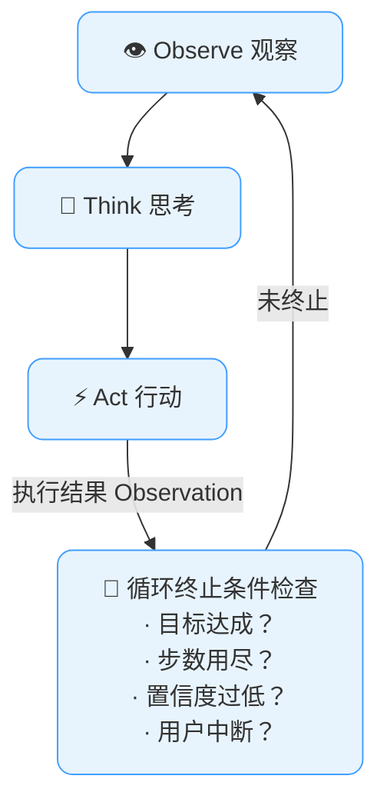
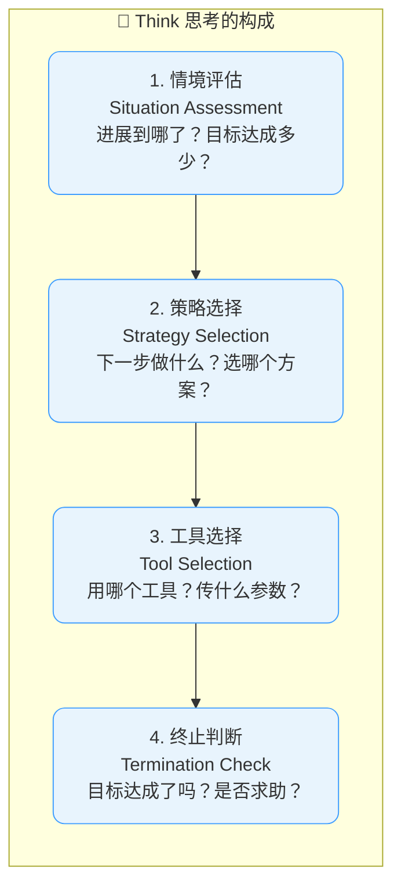

# 智能体运行闭环

## 概述

如果说五大核心特征（自主性、感知力、推理力、规划力、行动力）是AI Agent的"器官"，那么运行闭环就是Agent的"心跳"。

每一个AI Agent，无论简单还是复杂，无论使用的是Claude还是GPT，无论调用的是一个工具还是一百个工具，其底层都在持续运行同一个基本循环：**观察（Observe）-> 思考（Think）-> 行动（Act）**。这个OTA循环是Agent存在的本质形态——Agent不是在"回答问题"，而是在"循环执行"，直到目标达成。

本章将从OODA循环的历史起源讲起，深入拆解OTA循环的每一步，给出完整的代码实现，探讨循环中的反馈机制和终止条件，分析其与ReAct模式的关联，最后通过一个完整的"预订机票"案例进行全程走读。

**`Image-Prompt(OTA loop agent heartbeat concept):`**
```
flat-design minimalist 2D vector illustration, white background. Center: a circular loop diagram forming a heartbeat-like rhythm. Three connected rounded nodes arranged in a triangle cycle: top node labeled "Observe" with an eye/magnifying glass icon in primary blue #409EFF; bottom-right node labeled "Think" with a brain/gear icon in medium blue; bottom-left node labeled "Act" with a hand/action icon in deep blue #1a1a2e. Curved arrows connect them in a continuous clockwise cycle: Observe→Think→Act→Observe. In the center of the triangle: a pulsing heart-shaped outline symbolizing the "heartbeat" of the agent. Below the diagram: subtitle "The Agent's Fundamental Rhythm" in deep blue. Clean white background, rounded shapes, thin lines, academic educational illustration style.
```

## OODA循环的起源

### John Boyd的军事战略理论

OTA循环的概念可以追溯到美国空军上校、军事战略家**John Boyd**在20世纪70年代提出的**OODA循环**（OODA Loop）。

```
OODA循环 —— 战斗机飞行员空战决策模型：

```mermaid
flowchart TD
  observeOoda["👁️ Observe 观察<br/>观察环境，收集信息<br/>敌机位置、速度、高度、态势"]
  orient["🧭 Orient 判断/定向<br/>分析信息，形成态势感知<br/>Boyd认为最关键的一步"]
  decide["✅ Decide 决策<br/>选择行动方案<br/>机动规避？发起攻击？呼叫支援？"]
  actOoda["⚡ Act 行动<br/>执行决策<br/>操纵飞机，发射武器"]

  subgraph keyInsight ["💡 关键思想"]
    cycleAdvantage["谁的 OODA 循环转得更快，谁就赢。<br/>快速循环让对手始终处于"反应"状态<br/>而非"主动"状态。"]
  end

  observeOoda --> orient
  orient --> decide
  decide --> actOoda
  actOoda -.->|循环回到| observeOoda

  classDef boxStyle fill:#e8f4fd,stroke:#409EFF,rx:10
  class observeOoda,orient,decide,actOoda,cycleAdvantage boxStyle
```

Boyd的洞见是：**空战的胜负不取决于谁有更好的飞机，而取决于谁能更快地完成OODA循环**。快速循环的一方可以在对手还在处理上一轮信息时，已经完成了新一轮的观察-判断-决策-行动，从而"进入对手的决策循环内部"，让对手始终慢半拍。

### 从OODA到OTA

AI Agent继承了OODA循环的核心思想，但做出了适合AI系统的简化和改造：

```
OODA（军事）          OTA（AI Agent）          变化原因
────────────         ──────────────           ────────
Observe（观察）  →   Observe（观察）          保持，核心功能不变
Orient（判断）   →   Think（思考）           合并了Orient和Decide
Decide（决策）   →   纳入Think               因为LLM同时做分析和决策
Act（行动）      →   Act（行动）             保持，核心功能不变
```

在AI Agent中，Orient和Decide被合并为**Think**，因为LLM的推理过程天然地同时包含了"分析局势"和"决定下一步"。LLM的一次推理既理解了当前状态，也选好了下一步行动。

**`Image-Prompt(OODA to OTA loop evolution from military to AI):`**
```
flat-design minimalist 2D vector illustration, white background. A side-by-side comparison of two loop diagrams. Left side: "OODA Loop (Military Strategy)" title in deep blue #1a1a2e, showing a 4-node circular diagram with "Observe" (eye), "Orient" (compass), "Decide" (checkmark), "Act" (fighter jet icon), connected by clockwise arrows in gray. A small military-style crosshair icon above. Right side: "OTA Loop (AI Agent)" title, showing a simplified 3-node circular diagram with "Observe" (eye), "Think" (brain, combining Orient+Decide), "Act" (tool/gear icon), connected by primary blue #409EFF arrows. Between the two diagrams: a transformation arrow labeled "Simplified for AI" with the note "Orient+Decide = Think". Clean rounded shapes, centered symmetrical layout, academic educational style.
```

## AI Agent的OTA循环：Observe -> Think -> Act

### OTA循环全景图




### 第一步：Observe（观察）—— "现在什么情况？"

Observe是OTA循环的起点。在这一步，Agent收集和整理所有相关的信息。

**输入来源：**

| 来源 | 内容 | 示例 |
|------|------|------|
| 用户输入 | 用户的自然语言消息、指令 | "帮我订一张下周三去上海的机票" |
| 工具返回 | 上一次Action的调用结果 | API返回的航班列表JSON |
| 系统状态 | 当前任务的执行状态 | "已完成第2/5步"、"已用时3分钟" |
| 记忆系统 | 从记忆模块检索到的相关信息 | 用户偏好靠过道座位、历史订票记录 |
| 环境数据 | 外部环境的变化 | 当前时间、用户所在位置、系统负载 |

**Observe的实现：**

```python
class Observation:
    """一次观察的结构化表示"""

    def __init__(self):
        self.user_input = None         # 用户新消息（如果有）
        self.tool_results = []         # 最近的工具调用结果列表
        self.task_state = {}           # 任务执行状态
        self.retrieved_memories = []   # 从记忆系统检索到的信息
        self.system_events = []        # 系统级事件
        self.timestamp = datetime.now()

    def summarize_for_llm(self):
        """将观察整理为供LLM理解的格式"""
        parts = []

        if self.user_input:
            parts.append(f"[用户消息] {self.user_input}")

        if self.tool_results:
            parts.append("[工具返回结果]")
            for result in self.tool_results:
                parts.append(f"  · {result.tool_name}: {result.summary}")

        if self.retrieved_memories:
            parts.append("[相关记忆]")
            for mem in self.retrieved_memories:
                parts.append(f"  · {mem.content}")

        if self.task_state:
            parts.append(f"[任务状态] 第{self.task_state.get('step', 0)}步"
                         f" / 计划共{self.task_state.get('total_steps', '?')}步")

        return "\n".join(parts)
```

**Observe的深度不只是"看到"，更是"理解"：**

```
同样是观察到一个API错误：

差观察："API返回了429错误"
   → Agent只知道"出错了"，但不知道为什么，也不知道怎么办

好观察：
  "API返回了429错误（频率限制）。
   当前调用频率：每分钟62次，限额50次。
   最近10次调用中，有8次是对同一个端点的重复查询。
   建议：1)等待5秒后重试 2)将重复查询合并为批量请求 3)调整后续调用间隔为1.5秒"
   → Agent不仅知道出错，还理解了原因和解决方案
```

### 第二步：Think（思考）—— "我该做什么？"

Think是OTA循环的核心。在这一步，LLM作为推理引擎，基于当前观察到的信息，进行推理并决定下一步行动。

**Think的内容：**



**Think的输出格式：**

在工程实现中，Think的输出通常被结构化，以便后续的Act步骤可以直接解析执行：

```python
@dataclass
class ThoughtResult:
    """Think步骤的结构化输出"""

    # 分析部分（面向人类阅读）
    analysis: str
    # "用户要求查询航班，当前已有目的地和日期信息，缺少出发城市。
    #  我应首先确认出发城市，再开始搜索。"

    # 决策部分（面向机器执行）
    action_type: str
    # "tool_call" | "ask_user" | "finish" | "error"

    # 如果是工具调用
    tool_name: Optional[str] = None      # "search_flights"
    tool_params: Optional[dict] = None   # {"from": "北京", "to": "上海", "date": "2025-07-16"}

    # 如果是询问用户
    question: Optional[str] = None       # "请问您从哪个城市出发？"

    # 如果是完成任务
    final_answer: Optional[str] = None   # "已为您找到3个合适航班，推荐如下..."

    # 思考的置信度
    confidence: float = 1.0  # 0.0~1.0，表示Agent对这一步决策有多确定
```

### 第三步：Act（行动）—— "动手干！"

Act是OTA循环中"把想法变成现实"的步骤。Agent根据Think的输出，实际调用工具或与用户交互。

**Act的类型：**

```
Act的四种基本类型：

1. 工具调用（Tool Call）
   → 调用外部API、数据库、文件系统、代码执行器
   → 输出：工具返回的结果
   → 示例：search_flights(from="北京", to="上海", date="2025-07-16")

2. 用户交互（User Interaction）
   → 向用户提问、确认、展示中间结果
   → 输出：用户的回复
   → 示例："找到3个航班，您更看重价格还是时间？"

3. 状态更新（State Update）
   → 更新任务状态、记录决策、写入记忆
   → 输出：更新后的内部状态
   → 示例：将"用户偏好靠窗座位"写入记忆

4. 任务终止（Task Termination）
   → 输出最终结果、保存成果、清理资源
   → 输出：最终答案
   → 示例：返回完整的航班推荐报告
```

**Act的实现注意事项：**

```python
class ActionExecutor:
    """动作执行器 —— 安全地执行Agent的决策"""

    def __init__(self, tools_registry, safety_config):
        self.tools = tools_registry
        self.safety = safety_config
        self.execution_log = []

    def execute(self, thought: ThoughtResult) -> dict:
        """执行一步行动"""
        step_start = time.time()

        # === 执行前安全检查 ===
        if thought.action_type == "tool_call":
            # 检查工具是否在白名单中
            if thought.tool_name not in self.safety.allowed_tools:
                return self._safety_block(thought, "工具不在白名单中")

            # 检查参数是否合法
            validation = self._validate_params(thought.tool_name, thought.tool_params)
            if not validation.valid:
                return self._safety_block(thought, f"参数校验失败: {validation.error}")

            # 高风险操作需要人工确认
            if self.tools[thought.tool_name].risk_level == "high":
                approved = self._request_user_approval(thought)
                if not approved:
                    return {"status": "cancelled", "reason": "用户未批准此操作"}

        # === 执行操作 ===
        try:
            if thought.action_type == "tool_call":
                tool = self.tools[thought.tool_name]
                result = tool.call(**thought.tool_params)

            elif thought.action_type == "ask_user":
                result = self._ask_user(thought.question)

            elif thought.action_type == "finish":
                result = {"status": "finished", "output": thought.final_answer}

            else:
                result = {"status": "error", "reason": "未知的action_type"}

        except ToolTimeoutError as e:
            # 超时处理
            result = self._handle_timeout(thought, e)
        except ToolExecutionError as e:
            # 执行失败处理
            result = self._handle_error(thought, e)

        # === 执行后记录 ===
        step_end = time.time()
        self.execution_log.append({
            "step": len(self.execution_log) + 1,
            "action": thought.action_type,
            "tool": thought.tool_name,
            "duration_ms": (step_end - step_start) * 1000,
            "success": result.get("status") == "success",
        })

        return result
```

**`Image-Prompt(OTA cycle three steps detailed breakdown):`**
```
flat-design minimalist 2D vector illustration, white background. A vertical three-step flow diagram showing the OTA cycle in detail. Step 1 (top): large rounded rectangle labeled "1. Observe" in primary blue #409EFF, containing small input source icons arranged horizontally — user message bubble, API JSON return, memory document, sensor data waves, system clock — with downward arrows feeding into a unified "Structured Perception" box. Step 2 (middle): rounded rectangle labeled "2. Think" with an LLM/brain icon at center, surrounded by four analysis bubbles: "Situation Assessment," "Strategy Selection," "Tool Selection," "Termination Check." Step 3 (bottom): rounded rectangle labeled "3. Act" with four action type icons: tool API call, user question mark, state update gear, and finish flag. A feedback loop arrow curves back from Step 3 to Step 1. Deep blue #1a1a2e labels, clean white background, rounded shapes, academic educational style.
```

## 完整代码示例：一个带OTA循环的简单Agent实现

以下是一个完整的、可运行的OTA循环Agent实现。它虽然简单（约200行），但包含了OTA循环的所有关键机制：

```python
"""
一个完整的OTA循环Agent实现

这个Agent展示了OTA循环的每个环节：
- Observe：收集用户输入、工具返回、记忆内容
- Think：LLM推理，决定下一步行动
- Act：安全地执行工具调用或用户交互
- 循环控制：终止条件检查、错误恢复
"""

import json
import time
from typing import Any, Optional
from dataclasses import dataclass, field
from enum import Enum


# ============================================================
# 数据结构定义
# ============================================================

class ActionType(Enum):
    TOOL_CALL = "tool_call"       # 调用工具
    ASK_USER = "ask_user"         # 询问用户
    FINISH = "finish"             # 完成任务
    ERROR = "error"               # 出错了

@dataclass
class Observation:
    """观察结果"""
    user_message: Optional[str] = None
    tool_results: list = field(default_factory=list)
    memories: list = field(default_factory=list)
    task_progress: dict = field(default_factory=dict)
    step_count: int = 0

    def to_prompt(self) -> str:
        """将观察转化为供LLM推理的文本"""
        parts = []
        if self.user_message:
            parts.append(f"用户消息: {self.user_message}")
        if self.tool_results:
            parts.append("最近的操作结果:")
            for r in self.tool_results[-3:]:  # 只展示最近3条
                parts.append(f"  [{r['tool']}] {r['summary']}")
        if self.memories:
            parts.append("相关记忆:")
            for m in self.memories:
                parts.append(f"  - {m}")
        parts.append(f"当前第{self.step_count}步")
        return "\n".join(parts)

@dataclass
class Thought:
    """思考结果"""
    analysis: str                         # 分析过程
    action_type: ActionType               # 行动类型
    tool_name: Optional[str] = None       # 工具名
    tool_params: Optional[dict] = None    # 工具参数
    question: Optional[str] = None        # 要问用户的问题
    final_answer: Optional[str] = None    # 最终答案
    confidence: float = 1.0               # 决策置信度

@dataclass
class ActionResult:
    """行动结果"""
    status: str           # "success" | "error" | "timeout" | "cancelled"
    data: Any = None
    summary: str = ""
    error: Optional[str] = None

# ============================================================
# OTA Agent 主体
# ============================================================

class OTAAgent:
    """
    基于OTA循环的AI Agent

    核心循环:
        while not should_terminate:
            observation = observe()    # 收集当前状态
            thought = think(observation)  # LLM推理决定下一步
            result = act(thought)      # 执行决策
            update_state(result)       # 更新状态 → 下一轮循环
    """

    def __init__(self, llm_client, tools: dict,
                 max_steps: int = 15,
                 confidence_threshold: float = 0.3):
        self.llm = llm_client
        self.tools = tools
        self.max_steps = max_steps
        self.confidence_threshold = confidence_threshold

        # Agent内部状态
        self.memory = MemorySystem()
        self.history: list[dict] = []     # 完整的执行历史
        self.step_count = 0

    def run(self, user_goal: str) -> str:
        """
        运行Agent，执行用户的指令。

        这是OTA循环的入口函数。
        """
        # 初始化：将用户目标写入记忆
        self.memory.add_user_message(user_goal)

        # === OTA 主循环 ===
        while self.step_count < self.max_steps:
            self.step_count += 1

            # ─── O: Observe ───────────────────────────
            observation = self._observe()

            # ─── T: Think ─────────────────────────────
            thought = self._think(observation)

            # 检查是否需要终止
            if thought.action_type == ActionType.FINISH:
                self._log(f"任务完成: {thought.final_answer[:100]}...")
                return thought.final_answer

            if thought.confidence < self.confidence_threshold:
                # 置信度过低 → 向用户求助而非胡猜
                return self._ask_user_for_help(observation, thought)

            # ─── A: Act ───────────────────────────────
            result = self._act(thought)

            # ─── 记录和反馈 ────────────────────────────
            self._record_step(observation, thought, result)

            # 检查致命错误
            if result.status == "fatal_error":
                return f"抱歉，任务执行中遇到无法恢复的错误: {result.error}"

        # 达到最大步数
        return f"任务执行达到{self.max_steps}步上限，未能完成。当前进度: {self._summarize_progress()}"

    # ============================================================
    # O: Observe（观察）
    # ============================================================
    def _observe(self) -> Observation:
        """
        收集当前状态的所有信息。

        信息来源：
        1. 最近的用户消息
        2. 最近几轮的工具调用结果
        3. 从记忆系统检索到的相关信息
        4. 当前任务进度
        """
        obs = Observation(step_count=self.step_count)

        # 获取最近的工具调用结果（从历史记录中提取）
        recent_actions = [h for h in self.history[-5:] if h.get("result")]
        for action in recent_actions:
            obs.tool_results.append({
                "tool": action.get("tool_name", "unknown"),
                "summary": self._summarize_result(action["result"]),
            })

        # 从记忆系统检索相关上下文
        obs.memories = self.memory.retrieve_relevant(query=self._get_current_context())

        # 任务进度
        obs.task_progress = {
            "step": self.step_count,
            "max_steps": self.max_steps,
            "tools_called": len([h for h in self.history if h.get("type") == "tool_call"]),
        }

        return obs

    def _summarize_result(self, result: ActionResult) -> str:
        """将工具返回结果压缩为简短的摘要"""
        if result.summary:
            return result.summary
        if result.error:
            return f"错误: {result.error}"
        if isinstance(result.data, dict):
            return json.dumps(result.data, ensure_ascii=False)[:200]
        return str(result.data)[:200]

    # ============================================================
    # T: Think（思考）
    # ============================================================
    def _think(self, observation: Observation) -> Thought:
        """
        LLM推理：基于当前观察，决定下一步行动。

        这是整个Agent最核心的步骤。
        """
        # 构建完整的推理提示词
        system_prompt = self._build_system_prompt()
        user_prompt = self._build_think_prompt(observation)

        # 调用LLM进行推理
        llm_response = self.llm.generate(
            system=system_prompt,
            messages=self.memory.get_recent_context(),
            user_prompt=user_prompt,
            response_format="json",  # 要求结构化JSON输出
        )

        # 解析LLM的结构化输出
        return self._parse_thought(llm_response)

    def _build_system_prompt(self) -> str:
        """构建系统提示词"""
        tools_desc = "\n".join([
            f"- {name}: {tool.description}"
            f" 参数: {json.dumps(tool.param_schema, ensure_ascii=False)}"
            for name, tool in self.tools.items()
        ])

        return f"""你是一个AI智能体，通过观察-思考-行动(OTA)循环来执行用户的任务。

## 可用工具
{tools_desc}

## 思考规范
每次思考请输出以下JSON格式：
{{
    "analysis": "对当前情况的详细分析",
    "action_type": "tool_call|ask_user|finish",
    "tool_name": "工具名（仅action_type=tool_call时需要）",
    "tool_params": {{}}（仅action_type=tool_call时需要）,
    "question": "要询问用户的问题（仅action_type=ask_user时需要）",
    "final_answer": "最终答案（仅action_type=finish时需要）",
    "confidence": 0.0-1.0（你对这一步决策的信心程度）
}}

## 决策原则
1. 优先一次性完成简单任务
2. 复杂任务需要多步执行时，先做好规划
3. 信息不足时先向用户确认，不要猜测
4. 工具调用失败时尝试替代方案，不要放弃"""

    def _build_think_prompt(self, obs: Observation) -> str:
        """构建推理提示词"""
        return f"""## 当前状态
{obs.to_prompt()}

## 你的任务
用户的原始目标是: {self.memory.get_user_goal()}

基于当前状态，请决定下一步做什么。"""

    def _parse_thought(self, llm_output: str) -> Thought:
        """解析LLM的JSON输出为Thought对象"""
        try:
            data = json.loads(llm_output)
            return Thought(
                analysis=data.get("analysis", ""),
                action_type=ActionType(data["action_type"]),
                tool_name=data.get("tool_name"),
                tool_params=data.get("tool_params"),
                question=data.get("question"),
                final_answer=data.get("final_answer"),
                confidence=data.get("confidence", 0.8),
            )
        except (json.JSONDecodeError, KeyError, ValueError) as e:
            # LLM输出格式错误 → 回退到询问用户
            return Thought(
                analysis=f"LLM输出解析失败: {e}",
                action_type=ActionType.ASK_USER,
                question="抱歉，我在推理时遇到了内部错误。能换个方式重新描述您的需求吗？",
                confidence=0.1,
            )

    # ============================================================
    # A: Act（行动）
    # ============================================================
    def _act(self, thought: Thought) -> ActionResult:
        """执行Think的决策"""
        if thought.action_type == ActionType.TOOL_CALL:
            return self._execute_tool(thought.tool_name, thought.tool_params)

        elif thought.action_type == ActionType.ASK_USER:
            # 需要用户输入 → 这是同步等待点
            # 实际系统中这里会暂停循环，等待用户回复
            return ActionResult(
                status="waiting_user",
                summary=f"询问用户: {thought.question}",
            )

        elif thought.action_type == ActionType.ERROR:
            return ActionResult(
                status="error",
                error=thought.analysis,
            )

        else:
            return ActionResult(status="unknown_action")

    def _execute_tool(self, tool_name: str, params: dict) -> ActionResult:
        """安全地执行工具调用"""
        if tool_name not in self.tools:
            return ActionResult(
                status="error",
                error=f"未知工具: {tool_name}",
                summary=f"工具'{tool_name}'不在注册表中",
            )

        tool = self.tools[tool_name]

        try:
            start = time.time()
            result_data = tool.execute(**params)
            elapsed = time.time() - start

            return ActionResult(
                status="success",
                data=result_data,
                summary=f"调用{tool_name}成功 (耗时{elapsed:.1f}s)",
            )

        except Exception as e:
            return ActionResult(
                status="error",
                error=str(e),
                summary=f"调用{tool_name}失败: {str(e)[:100]}",
            )

    # ============================================================
    # 循环管理
    # ============================================================
    def _record_step(self, obs: Observation, thought: Thought, result: ActionResult):
        """记录每一步的完整信息到历史"""
        record = {
            "step": self.step_count,
            "timestamp": time.time(),
            "observation_summary": obs.to_prompt()[:200],
            "analysis": thought.analysis,
            "action_type": thought.action_type.value,
            "tool_name": thought.tool_name,
            "tool_params": thought.tool_params,
            "result_status": result.status,
            "result_summary": result.summary,
        }
        self.history.append(record)
        self.memory.add_step(record)

    def _log(self, message: str):
        """记录日志"""
        print(f"[Step {self.step_count}] {message}")

    def _summarize_progress(self) -> str:
        """总结当前进度"""
        total = len(self.history)
        success = len([h for h in self.history if h.get("result_status") == "success"])
        return f"共执行{total}步，成功{success}步"

    def _ask_user_for_help(self, obs: Observation, thought: Thought) -> str:
        """当Agent不确定时，向用户寻求帮助"""
        return (
            f"抱歉，我对下一步不太确定（置信度: {thought.confidence:.0%}）。\n"
            f"目前的情况是: {obs.to_prompt()}\n"
            f"我的分析是: {thought.analysis}\n"
            f"请问您希望我接下来怎么做？"
        )

    def _get_current_context(self) -> str:
        """获取当前上下文用于记忆检索"""
        recent = self.history[-3:] if self.history else []
        return " ".join([h.get("analysis", "") for h in recent])


# ============================================================
# 辅助：简化的记忆系统
# ============================================================
class MemorySystem:
    """简化版记忆系统 —— 实际项目应使用向量数据库"""

    def __init__(self):
        self.user_goal = ""
        self.messages: list[dict] = []
        self.steps: list[dict] = []

    def add_user_message(self, content: str):
        self.messages.append({"role": "user", "content": content})
        if not self.user_goal:
            self.user_goal = content  # 第一条用户消息作为目标

    def add_step(self, record: dict):
        self.steps.append(record)
        self.messages.append({
            "role": "assistant",
            "content": f"[{record.get('tool_name', 'think')}] {record.get('result_summary', '')}",
        })

    def get_recent_context(self, n: int = 10):
        return self.messages[-n:]

    def get_user_goal(self) -> str:
        return self.user_goal

    def retrieve_relevant(self, query: str) -> list[str]:
        """简化版检索 —— 实际应使用向量相似度搜索"""
        # 返回最近的步骤作为"相关记忆"
        return [s.get("result_summary", "") for s in self.steps[-3:]]


# ============================================================
# 使用示例
# ============================================================
if __name__ == "__main__":
    """
    使用示例：创建一个机票预订Agent并运行它

    注意：这是伪代码，实际需要替换llm_client和tools为真实实现。
    """

    # 定义工具
    tools = {
        "search_flights": FlightSearchTool(),
        "get_weather": WeatherTool(),
        "book_flight": FlightBookingTool(),
        "send_email": EmailTool(),
    }

    # 创建Agent
    agent = OTAAgent(
        llm_client=YourLLMClient(),  # 替换为实际的LLM客户端
        tools=tools,
        max_steps=10,
        confidence_threshold=0.3,
    )

    # 运行
    result = agent.run("帮我订一张下周三从北京到上海的最便宜机票")
    print(f"最终结果: {result}")
```

**`Image-Prompt(feedback mechanism in OTA loop adaptive adjustment):`**
```
flat-design minimalist 2D vector illustration, white background. A looping diagram showing three types of feedback in the OTA cycle. Center: an OTA triangle (Observe→Think→Act) in primary blue #409EFF. Three curved feedback arrows enter the "Observe" node from the "Act" node, each with a different color label: Green arrow labeled "Positive Feedback — Reinforce Strategy" with a thumbs-up icon. Red arrow labeled "Negative Feedback — Adjust Strategy" with a warning triangle icon. Gray arrow labeled "Neutral Feedback — Supplement Info" with an information "i" icon. Below the diagram: a small box showing "Adaptive Adjustment" with icons for replanning (refresh) and loop detection (infinity symbol crossed out). Deep blue #1a1a2e labels, clean white background, rounded shapes, academic educational illustration style.
```

## 循环中的反馈机制

OTA循环之所以强大，在于执行结果会反馈回下一轮的Observation中，形成持续的学习和调整。

### 反馈链路的解剖

```
第N轮循环:
┌──────────────────────────────────────────────────────────┐
│  Observe: "机票搜索结果为空"                              │
│  Think: "可能是日期格式问题，改用标准格式YYYY-MM-DD重试"    │
│  Act: search_flights(date="2025-07-16")                  │
│      → 返回：3个航班                                     │
└──────────────────────────────────────────────────────────┘
                          │
                          ▼ 结果反馈到下一轮
┌──────────────────────────────────────────────────────────┐
│  Observe: "找到3个航班，价格从¥580到¥1280"                │  ← 上轮Act的结果在这里被观察
│  Think: "用户要最便宜的，¥580的春秋航空9C8817最合适。       │
│          但起飞时间早上6点，需确认用户是否能接受。"         │
│  Act: ask_user("最便宜的是春秋航空9C8817，早上6点起飞，     │
│                 ¥580。但时间很早，可以接受吗？")            │
└──────────────────────────────────────────────────────────┘
                          │
                          ▼ 用户回复"可以" → 新一轮
┌──────────────────────────────────────────────────────────┐
│  Observe: "用户回复'可以'，确认预订9C8817"                │  ← 用户反馈进入Observe
│  Think: "确认预订。用户偏好已更新：价格优先于舒适度。"      │
│  Act: book_flight(flight_id="9C8817")                    │
│      → 返回：预订成功，订单号BK20250716-001               │
└──────────────────────────────────────────────────────────┘
```

### 反馈机制的三种类型

```
1. 正向反馈（Positive Feedback）—— 强化当前策略
   · 工具调用成功 → 继续按计划执行
   · 用户表示满意 → 记录这个策略是好的
   · 目标推进顺利 → 保持当前节奏

2. 负向反馈（Negative Feedback）—— 调整当前策略
   · 工具调用失败 → 尝试替代工具或参数
   · 用户表示不满 → 重新分析需求，调整策略
   · 发现新障碍 → 修改执行计划

3. 中性反馈（Neutral Feedback）—— 补充信息
   · 发现新的可选方案 → 扩展选择空间
   · 获得额外上下文 → 增强后续推理
   · DD时间变化 → 更新约束条件
```

### 基于反馈的自适应调整

```python
class AdaptiveAgent(OTAAgent):
    """增强版Agent：能够根据反馈动态调整策略"""

    def __init__(self, *args, **kwargs):
        super().__init__(*args, **kwargs)
        self.strategy_history = []  # 追踪策略效果
        self.current_plan = None

    def _think_with_adaptation(self, observation: Observation) -> Thought:
        """带自适应调整的Think步骤"""

        # 检测是否需要调整计划
        if self._should_replan(observation):
            self._log("检测到需要重新规划...")
            self.current_plan = self._replan(observation)
            return Thought(
                analysis="执行条件变化，已更新执行计划",
                action_type=ActionType.TOOL_CALL,
                tool_name=self.current_plan[0]["tool"],
                tool_params=self.current_plan[0]["params"],
                confidence=0.85,
            )

        # 检测是否陷入循环
        if self._detect_loop():
            self._log("检测到可能陷入循环，强制改变策略...")
            return self._force_alternative(observation)

        # 正常推理
        return super()._think(observation)

    def _should_replan(self, obs: Observation) -> bool:
        """判断是否需要重新规划"""
        if not self.current_plan:
            return False

        # 条件1：最近的工具调用都失败了
        recent_failures = [
            h for h in self.history[-3:]
            if h.get("result_status") == "error"
        ]
        if len(recent_failures) >= 2:
            return True

        # 条件2：发现新的关键信息改变了前提
        if obs.memories:
            for mem in obs.memories:
                if mem.get("type") == "critical_update":
                    return True

        # 条件3：已经偏离原定计划太远
        if self.step_count > self.current_plan_expected_steps * 1.5:
            return True

        return False

    def _detect_loop(self) -> bool:
        """检测是否陷入重复循环"""
        # 检查最近3步是否在重复同样的操作
        recent_actions = [
            (h.get("tool_name"), str(h.get("tool_params")))
            for h in self.history[-3:]
            if h.get("action_type") == "tool_call"
        ]

        if len(recent_actions) >= 2:
            # 如果最近两步完全一样，就是循环
            return recent_actions[-1] == recent_actions[-2]

        return False

    def _force_alternative(self, obs: Observation) -> Thought:
        """强制选择一个不同的行动路径"""
        # 获取最近使用过的工具
        used_tools = set(
            h.get("tool_name") for h in self.history[-5:]
            if h.get("action_type") == "tool_call"
        )

        # 选择一个还没用过但相关的工具
        unused = [
            name for name, tool in self.tools.items()
            if name not in used_tools
        ]

        if unused:
            return Thought(
                analysis="尝试切换策略，使用备选工具",
                action_type=ActionType.TOOL_CALL,
                tool_name=unused[0],
                tool_params={},
                confidence=0.5,
            )
        else:
            # 没有备选工具了 → 向用户求助
            return Thought(
                analysis="所有工具都尝试过了，需要用户介入",
                action_type=ActionType.ASK_USER,
                question="我尝试了多种方法但遇到了困难。您能否提供更多信息或指导？",
                confidence=0.3,
            )
```

**`Image-Prompt(OTA loop six termination conditions diagram):`**
```
flat-design minimalist 2D vector illustration, white background. A hexagonal radar-style layout with 6 termination condition cards arranged around a central "OTA Loop" icon. Each card is a rounded rectangle with an icon and label in deep blue #1a1a2e: Top card "Goal Achieved" (checkered flag icon, green accent). Top-right "Step Limit" (stopwatch/counter icon, orange accent). Bottom-right "Low Confidence" (question mark with declining bar, yellow accent). Bottom "User Interrupt" (hand stop gesture, red accent, marked HIGHEST PRIORITY). Bottom-left "Fatal Error" (exclamation in triangle, dark red accent). Top-left "Loop Detected" (infinity loop with slash, purple accent). Each card has a thin colored border matching its accent. Center shows the OTA cycle with an "X" mark overlay. Clean white background, academic educational style.
```

## 循环终止条件：何时停止？

OTA循环不能无限运行下去。一个成熟的Agent需要明确的终止条件来确保效率和安全性。

### 终止条件的分类

```
OTA循环的六大终止条件：

┌─────────────────────────────────────────────────────────────┐
│                                                              │
│ 1. ✅ 目标达成（Goal Achieved）                               │
│    Agent判断用户的目标已完成                                  │
│    示例：航班已预订成功，确认信息已发送给用户                   │
│    置信度：高（Agent主动判断）                                 │
│                                                              │
│ 2. ⏱️ 步数限制（Step Limit）                                  │
│    执行步数达到预设上限（如15步）                              │
│    示例：复杂任务卡在某个环节一直重试                          │
│    置信度：高（硬性限制）                                      │
│                                                              │
│ 3. 🤔 置信度过低（Low Confidence）                            │
│    Agent对下一步行动的信心低于阈值                             │
│    示例：面对完全陌生的情境，不知道该怎么办                     │
│    置信度：中（需配合求助机制）                                │
│                                                              │
│ 4. 🛑 用户中断（User Interrupt）                              │
│    用户主动要求停止                                           │
│    示例："不用了，我改变主意了"                                │
│    置信度：最高（用户意志）                                    │
│                                                              │
│ 5. 💀 致命错误（Fatal Error）                                 │
│    遇到无法恢复的系统级错误                                    │
│    示例：LLM服务宕机、关键工具不可用                           │
│    置信度：高（客观限制）                                      │
│                                                              │
│ 6. 🔄 循环检测（Loop Detection）                              │
│    Agent检测到自己在重复做相同的事情                           │
│    示例：第3、4、5步都在调用同一个API且都失败                   │
│    置信度：高（需强制终止以避免资源浪费）                       │
│                                                              │
└─────────────────────────────────────────────────────────────┘
```

### 终止条件的优先级

并非所有终止条件同等重要。系统需要有明确的优先级：

```python
class TerminationManager:
    """循环终止管理器 —— 多条件综合判断"""

    # 优先级从高到低
    PRIORITY = {
        "user_interrupt": 100,    # 用户意志最高
        "fatal_error": 90,        # 系统故障
        "loop_detected": 80,      # 循环浪费资源
        "step_limit": 70,         # 超时保护
        "goal_achieved": 60,      # 最好但非最强的终止
        "low_confidence": 50,     # 可以升级处理
    }

    def __init__(self, max_steps=15, confidence_threshold=0.3):
        self.max_steps = max_steps
        self.confidence_threshold = confidence_threshold

    def check(self, agent_state: dict) -> Optional[str]:
        """
        检查所有终止条件，返回触发终止的原因（或None表示继续）

        重要：如果多个条件同时触发，返回优先级最高的。
        """
        triggers = []

        # 1. 用户中断
        if agent_state.get("user_interrupt"):
            triggers.append(("user_interrupt", "用户主动中断"))

        # 2. 致命错误
        if agent_state.get("fatal_error"):
            triggers.append(("fatal_error", agent_state["fatal_error"]))

        # 3. 循环检测
        if agent_state.get("loop_detected"):
            triggers.append(("loop_detected", "检测到重复循环"))

        # 4. 步数限制
        if agent_state.get("step_count", 0) >= self.max_steps:
            triggers.append(("step_limit",
                f"达到最大步数限制({self.max_steps})"))

        # 5. 目标达成
        if agent_state.get("goal_achieved"):
            triggers.append(("goal_achieved", "任务目标已达成"))

        # 6. 置信度过低
        if agent_state.get("last_confidence", 1.0) < self.confidence_threshold:
            triggers.append(("low_confidence",
                f"决策置信度过低({agent_state['last_confidence']:.0%})"))

        if not triggers:
            return None  # 不终止，继续循环

        # 按优先级排序，返回最高优先级的
        triggers.sort(key=lambda t: self.PRIORITY.get(t[0], 0), reverse=True)
        return triggers[0][0]

    def get_exit_message(self, reason: str, state: dict) -> str:
        """根据终止原因生成用户友好的退出消息"""
        messages = {
            "user_interrupt": "已根据您的要求停止任务。",
            "fatal_error": f"任务因系统错误中断: {state.get('fatal_error', '未知错误')}",
            "loop_detected": "检测到重复操作，已自动停止以避免资源浪费。是否需要更换策略重新尝试？",
            "step_limit": f"任务复杂度超出预期（已执行{state.get('step_count', 0)}步）。建议将任务拆分为更小的子任务。",
            "goal_achieved": state.get("final_output", "任务已完成。"),
            "low_confidence": f"我对当前情况不太确定。已完成的进度已保存。需要提供更多信息吗？",
        }
        return messages.get(reason, "任务已终止。")
```

**`Image-Prompt(ReAct pattern mapping to OTA loop comparison):`**
```
flat-design minimalist 2D vector illustration, white background. A mapping diagram showing the correspondence between ReAct pattern and OTA loop. Left side: a ReAct sequence displayed vertically — "Thought:" (brain icon), "Action:" (gear icon), "Observation:" (eye icon) — each as rounded rectangles in alternating colors. Right side: an OTA loop triangle with three nodes. Curved mapping arrows connect: ReAct "Observation" → OTA "Observe" (direct match), ReAct "Thought" → OTA "Think" (direct match), ReAct "Action" → OTA "Act" (direct match), and a feedback arrow showing ReAct's next Observation feeds back into the OTA loop. Below: a comparison label "ReAct = OTA implemented with LLM + Tool Calling." Primary blue #409EFF for key connections, deep blue #1a1a2e labels, clean white background, academic educational style.
```

## 与ReAct模式的关联

业界流传甚广的**ReAct**（Reasoning + Acting）模式，本质上就是OTA循环的一种特定实现方式。

### ReAct模式简介

ReAct由Google Research在2022年提出（论文: "ReAct: Synergizing Reasoning and Acting in Language Models"），核心思想是让LLM在执行任务时交替进行**推理（Reasoning）**和**行动（Acting）**。

```
ReAct 模式：

Thought: 我需要查一下今天的天气
Action: search_weather(city="上海")
Observation: 上海今天晴，26°C
Thought: 天气不错，用户可以户外活动。现在需要搜索适合晴天的上海景点
Action: search_attractions(city="上海", weather="晴天", type="户外")
Observation: 找到5个推荐景点...
Thought: 可以推荐给用户了
Action: finish("上海今天晴天26°C，推荐以下户外景点...")
```

### ReAct与OTA的映射关系

```
OTA循环                    ReAct模式                说明
────────                  ──────────               ────
Observe                   Observation             完全对应
Think                     Thought                 Think对应OTA的Think
Act                       Action                  Act对应OTA的Act
（新一轮的Observe）        Observation（工具返回）  工具返回作为新Observation
```

**关系总结**：ReAct是OTA循环在LLM Agent领域的具体实现模式。OTA是更高层的抽象框架，ReAct是OTA在"LLM+工具调用"这一技术栈下的最佳实践。

ReAct的核心贡献在于证明了**交替进行推理和行动比"先推理完再行动"或者"不推理只行动"的效果都要好**。

### ReAct vs 纯推理 vs 纯行动

```
同一个任务"上海今天适合户外跑步吗？"的三种处理方式：

方式一：纯推理（Chain-of-Thought）
  输出："首先需要查天气，然后看空气质量，再考虑..."
  问题：只能"想"，不能"做"。天气数据是编造的。

方式二：纯行动（直接工具调用）
  → 搜天气 → 搜空气质量 → 输出结果
  问题：可能搜了不相关的、重复的、或者忘了搜关键信息。

方式三：ReAct（推理+行动交替）
  Thought: 需要查询上海今天的天气
  Action: search_weather("上海", "今天")
  Observation: 晴，26°C，湿度55%，风速3级

  Thought: 天气条件适合跑步。再查空气质量。
  Action: search_aqi("上海")
  Observation: AQI 45，优

  Thought: 所有数据都很好，可以跑步。
  Action: finish("上海今天非常适合户外跑步！晴天26°C，空气质量优。建议早晨或傍晚，避开正午高温。")

  → 每一步都有推理指引，每一步推理都基于真实数据。
```

**`Image-Prompt(ReAct vs pure reasoning vs pure action comparison):`**
```
flat-design minimalist 2D vector illustration, white background. A three-column comparison layout. Column 1: "Pure Reasoning (CoT)" header, showing a brain icon thinking alone, with a red X mark indicating "No real data — makes up facts." Column 2: "Pure Action" header, showing scattered tool calls without direction, with a red X mark indicating "No guidance — calls irrelevant tools." Column 3: "ReAct Pattern" highlighted in primary blue #409EFF, showing an alternating sequence of Thought→Action→Observation→Thought, with a green checkmark indicating "Reasoning guides action, action provides real data." Each column is a rounded rectangle card. The ReAct column has a glowing border. Deep blue #1a1a2e labels, clean white background, academic educational style.
```

## 实际走读："预订机票"的OTA循环完整演示

让我们通过一个完整的案例，一步步跟踪Agent的OTA循环。

### 场景设定

**用户**："帮我订一张下周三从北京到上海的最便宜机票，最好是下午的航班。"

**Agent配置**：
- LLM：Claude 4 Sonnet
- 可用工具：`search_flights`、`get_weather`、`book_flight`、`send_email`
- 最大步数：12
- 置信度阈值：0.3

### 完整走读

```
═══════════════════════════════════════════════════════════════
                        初始化
═══════════════════════════════════════════════════════════════

Agent接收到用户指令，存储目标到记忆系统。
准备进入OTA循环。


═══════════════════════════════════════════════════════════════
第1轮 OTA循环
═══════════════════════════════════════════════════════════════

┌─ OBSERVE ─────────────────────────────────────────────────┐
│                                                             │
│  用户消息: "帮我订一张下周三从北京到上海的最便宜机票，       │
│            最好是下午的航班。"                               │
│  工具结果: (无，这是第一轮)                                  │
│  记忆: (无相关记忆)                                          │
│  进度: 第1步 / 共12步                                       │
│                                                             │
└─────────────────────────────────────────────────────────────┘

┌─ THINK ────────────────────────────────────────────────────┐
│                                                             │
│  LLM推理过程:                                                │
│  "用户要订机票。关键信息：                                   │
│   · 出发: 北京                                               │
│   · 目的地: 上海                                             │
│   · 日期: 下周三（需计算具体日期，假设今天是周一，            │
│           下周三 = 7月16日）                                  │
│   · 偏好: 最便宜 + 下午                                      │
│                                                              │
│   需要先搜索航班，获取实时数据和价格。                         │
│   参数：from=北京, to=上海, date=2025-07-16"                  │
│                                                              │
│  决策:                                                       │
│  {                                                           │
│    "action_type": "tool_call",                               │
│    "tool_name": "search_flights",                            │
│    "tool_params": {                                          │
│      "from": "北京",                                         │
│      "to": "上海",                                           │
│      "date": "2025-07-16"                                    │
│    },                                                        │
│    "confidence": 0.95                                        │
│  }                                                           │
│                                                              │
└─────────────────────────────────────────────────────────────┘

┌─ ACT ──────────────────────────────────────────────────────┐
│                                                             │
│  执行: search_flights(from="北京", to="上海",               │
│                       date="2025-07-16")                    │
│                                                             │
│  返回:                                                      │
│  {                                                          │
│    "status": "success",                                     │
│    "flights": [                                             │
│      {"id": "MU5101", "airline": "东航",                    │
│       "depart": "07:30", "arrive": "09:45",                │
│       "price": 580, "stops": 0},                           │
│      {"id": "CA1835", "airline": "国航",                    │
│       "depart": "14:00", "arrive": "16:20",                │
│       "price": 720, "stops": 0},                           │
│      {"id": "CZ8882", "airline": "南航",                    │
│       "depart": "16:30", "arrive": "18:50",                │
│       "price": 650, "stops": 0},                           │
│      {"id": "9C8817", "airline": "春秋",                    │
│       "depart": "13:15", "arrive": "15:30",                │
│       "price": 420, "stops": 1}                            │
│    ]                                                        │
│  }                                                          │
│                                                             │
└─────────────────────────────────────────────────────────────┘


═══════════════════════════════════════════════════════════════
第2轮 OTA循环
═══════════════════════════════════════════════════════════════

┌─ OBSERVE ─────────────────────────────────────────────────┐
│                                                             │
│  工具结果: "search_flights成功，找到4个航班：               │
│            东航MU5101(580元/早7:30)、国航CA1835(720元/午2:00)│
│            南航CZ8882(650元/午4:30)、春秋9C8817(420元/午1:15)│
│            转1次)"                                          │
│  进度: 第2步 / 共12步                                       │
│                                                             │
└─────────────────────────────────────────────────────────────┘

┌─ THINK ────────────────────────────────────────────────────┐
│                                                             │
│  LLM推理过程:                                                │
│  "用户要求: ①最便宜 ②下午的航班。                            │
│                                                              │
│   按价格排序:                                                │
│   1. 春秋9C8817: ¥420, 13:15出发 → 最便宜，时间是下午 ✓      │
│   2. 东航MU5101: ¥580, 07:30出发 → 便宜但不是下午 ✗          │
│   3. 南航CZ8882: ¥650, 16:30出发 → 下午，但比春秋贵230       │
│   4. 国航CA1835: ¥720, 14:00出发 → 下午，最贵 ✗              │
│                                                              │
│   春秋9C8817最符合: 最便宜(¥420) + 下午(13:15)。              │
│   但需要提醒用户：这是廉价航空，且有一次转机。                 │
│                                                              │
│   如果用户不接受转机，第二选择是南航CZ8882(¥650/直飞/下午)。   │
│                                                              │
│   我该直接订还是先确认？                                      │
│   → 用户没提到航空公司偏好，但"转机"可能影响体验。             │
│   → 最便宜的含转机 vs 稍贵但直飞，让用户自己选。"             │
│                                                              │
│  决策:                                                       │
│  {                                                           │
│    "action_type": "ask_user",                                │
│    "question": "找到以下符合您要求的航班:\n                   │
│      1. 春秋航空9C8817: ¥420, 13:15-15:30(转机1次)\n         │
│      2. 南航CZ8882: ¥650, 16:30-18:50(直飞)\n               │
│      第1个最便宜但需要转机，第2个稍贵但直飞。您选哪个？",      │
│    "confidence": 0.9                                         │
│  }                                                           │
│                                                              │
└─────────────────────────────────────────────────────────────┘

┌─ ACT ──────────────────────────────────────────────────────┐
│                                                             │
│  向用户展示两个选项，等待回复...                              │
│                                                             │
└─────────────────────────────────────────────────────────────┘

[用户回复: "选春秋吧，转机能省200多也值了"]


═══════════════════════════════════════════════════════════════
第3轮 OTA循环
═══════════════════════════════════════════════════════════════

┌─ OBSERVE ─────────────────────────────────────────────────┐
│                                                             │
│  用户消息: "选春秋吧，转机能省200多也值了"                    │
│  工具结果: (上一轮是ask_user，无工具结果)                     │
│  历史: 第2轮中向用户展示了两航班选项                          │
│  进度: 第3步 / 共12步                                       │
│                                                             │
└─────────────────────────────────────────────────────────────┘

┌─ THINK ────────────────────────────────────────────────────┐
│                                                             │
│  LLM推理过程:                                                │
│  "用户选择了春秋航空9C8817。用户明确表达了价格优先的偏好。    │
│   这是一个值得记住的用户偏好（价格 > 舒适度）。               │
│                                                              │
│   下一步: 预订9C8817航班。                                   │
│   需要确认：是否需要额外服务（选座、行李、保险）？             │
│   先订票，保险和行李可以让用户之后自己加。"                   │
│                                                              │
│  决策:                                                       │
│  {                                                           │
│    "action_type": "tool_call",                               │
│    "tool_name": "book_flight",                               │
│    "tool_params": {                                          │
│      "flight_id": "9C8817",                                  │
│      "passengers": 1,                                        │
│      "class": "economy"                                      │
│    },                                                        │
│    "confidence": 0.95                                        │
│  }                                                           │
│                                                              │
└─────────────────────────────────────────────────────────────┘

┌─ ACT ──────────────────────────────────────────────────────┐
│                                                             │
│  执行: book_flight(flight_id="9C8817", passengers=1,        │
│                    class="economy")                         │
│                                                             │
│  返回:                                                      │
│  {                                                          │
│    "status": "success",                                     │
│    "booking_id": "BK20250709-0042",                         │
│    "flight": "春秋航空9C8817",                               │
│    "date": "2025-07-16",                                    │
│    "route": "北京大兴 → 上海浦东(经停济南)",                 │
│    "depart": "13:15", "arrive": "15:30",                    │
│    "price": 420,                                            │
│    "seat": "18A (靠窗)",                                     │
│    "status": "已确认"                                        │
│  }                                                          │
│                                                             │
└─────────────────────────────────────────────────────────────┘


═══════════════════════════════════════════════════════════════
第4轮 OTA循环
═══════════════════════════════════════════════════════════════

┌─ OBSERVE ─────────────────────────────────────────────────┐
│                                                             │
│  工具结果: "预订成功！订单号BK20250709-0042。               │
│            春秋航空9C8817, 7月16日13:15出发, ¥420, 18A靠窗"  │
│  进度: 第4步 / 共12步                                       │
│                                                             │
└─────────────────────────────────────────────────────────────┘

┌─ THINK ────────────────────────────────────────────────────┐
│                                                             │
│  LLM推理过程:                                                │
│  "机票预订成功！用户的目标已经达成。现在应该：                 │
│   1. 向用户报告预订结果                                       │
│   2. 将航班信息发送到用户邮箱以便保存                          │
│   3. 更新用户画像（价格优先偏好）                              │
│   4. 在日历中添加提醒（如果有日历工具）                        │
│                                                              │
│   我有send_email工具，可以发送确认邮件。                       │
│   完成后任务结束。"                                           │
│                                                              │
│  决策:                                                       │
│  {                                                           │
│    "action_type": "tool_call",                               │
│    "tool_name": "send_email",                                │
│    "tool_params": {                                          │
│      "to": "user@example.com",                               │
│      "subject": "机票预订确认 - 7月16日北京→上海",            │
│      "body": "您的机票已预订成功！\n\n                        │
│        航班: 春秋航空9C8817\n                                 │
│        日期: 2025年7月16日(周三)\n                            │
│        出发: 13:15 北京大兴\n                                 │
│        到达: 15:30 上海浦东(经停济南)\n                       │
│        座位: 18A(靠窗)\n                                      │
│        票价: ¥420\n                                          │
│        订单号: BK20250709-0042\n\n                            │
│        温馨提示: 建议提前2小时到达机场。"                      │
│    },                                                        │
│    "confidence": 0.9                                         │
│  }                                                           │
│                                                              │
└─────────────────────────────────────────────────────────────┘

┌─ ACT ──────────────────────────────────────────────────────┐
│                                                             │
│  执行: send_email(...)                                      │
│  返回: {"status": "success", "message": "邮件已发送"}        │
│                                                             │
└─────────────────────────────────────────────────────────────┘


═══════════════════════════════════════════════════════════════
第5轮 OTA循环（最后一轮）
═══════════════════════════════════════════════════════════════

┌─ OBSERVE ─────────────────────────────────────────────────┐
│                                                             │
│  工具结果: "邮件已成功发送到user@example.com"                 │
│  进度: 第5步 / 共12步                                       │
│  目标状态: 机票已预订，确认邮件已发送                         │
│                                                             │
└─────────────────────────────────────────────────────────────┘

┌─ THINK ────────────────────────────────────────────────────┐
│                                                             │
│  LLM推理过程:                                                │
│  "所有任务已完成：                                            │
│   ✓ 搜索航班                                                 │
│   ✓ 根据用户偏好筛选                                         │
│   ✓ 预订机票                                                 │
│   ✓ 发送确认邮件                                             │
│                                                              │
│   用户的目标已完全达成。终止循环，输出最终结果。"              │
│                                                              │
│  决策:                                                       │
│  {                                                           │
│    "action_type": "finish",                                  │
│    "final_answer": "已为您预订好机票！\n\n                    │
│      ✈ 春秋航空9C8817\n                                      │
│      📅 2025年7月16日(周三)\n                                 │
│      🛫 13:15 北京大兴 → 15:30 上海浦东(经停济南)\n          │
│      💺 18A(靠窗)\n                                           │
│      💰 ¥420 (含税)\n                                         │
│      📧 确认邮件已发送至您的邮箱\n\n                          │
│      订单号: BK20250709-0042 (如需改签请提供此编号)\n         │
│      建议出发当天11:00前到达大兴机场。旅途愉快！",             │
│    "confidence": 0.98                                        │
│  }                                                           │
│                                                              │
└─────────────────────────────────────────────────────────────┘

┌─ ACT ──────────────────────────────────────────────────────┐
│                                                             │
│  循环终止。返回最终结果给用户。                               │
│                                                             │
└─────────────────────────────────────────────────────────────┘


═══════════════════════════════════════════════════════════════
                    任务完成统计
═══════════════════════════════════════════════════════════════

总步数: 5 (远未达到12步上限)
工具调用: 3次 (search_flights, book_flight, send_email)
用户交互: 1次 (确认航班选择)
总耗时: 约8秒
用户满意度: (预期很高 — Agent自动完成了所有操作)
学习收获: 用户偏好"价格优先"已自动存入长期记忆
```

### OTA循环的时序图

```
时间轴 ────────────────────────────────────────────────────────▶

用户    │                 │                  │
  │     │   "选春秋吧"     │                  │
  │     │                 │                  │
  ▼     │       ┌────────┐│                  │
Agent   │       │ 用户   ││                  │
  │   初始指令  │ 回复   ││                最终结果
  │     │       │  │     ││                  │
  ▼     ▼       ▼  ▼     ▼│                  ▼
┌─────┐┌─────┐┌─────┐┌─────┐┌─────┐
│O T A││O T A││O T A││O T A││O T A│
│ │ │ ││ │ │ ││ │ │ ││ │ │ ││ │ │ │
│ │ │ ││ │ │ ││ │ │ ││ │ │ ││F│I│N│
│搜索 ││询问 ││预订 ││发邮件││I N I│
│航班 ││用户 ││机票 ││确认  ││S H │
│ │ │ ││ │ │ ││ │ │ ││ │ │ ││ │ │ │
└─────┘└─────┘└─────┘└─────┘└─────┘
 第1轮   第2轮   第3轮   第4轮   第5轮
                                    ↑
                               Think判断目标达成
                               循环终止
```

**`Image-Prompt(flight booking OTA loop walkthrough timeline):`**
```
flat-design minimalist 2D vector illustration, white background. A horizontal timeline showing 5 rounds of OTA cycling for a flight booking task. Each round is a compact rounded rectangle card stacked with three mini-icons (Observe eye → Think brain → Act gear), numbered Round 1 through Round 5. Round 1 card: "Search Flights" with a search icon. Round 2 card: "Ask User Preference" with a question bubble. Round 3 card: "Book Flight" with a ticket icon. Round 4 card: "Send Email Confirmation" with an envelope icon. Round 5 card: "Finish" with a checkered flag icon highlighted in green. A progress line connects all cards with arrows. Below the timeline: a stats bar showing "5 Rounds, 3 Tool Calls, 1 User Interaction, ~8s Total." Primary blue #409EFF for active cards, deep blue #1a1a2e labels, clean white background, academic educational illustration.
```

## 总结

OTA循环（Observe -> Think -> Act）是AI Agent运行的"心跳"。它来源于军事战略中的OODA循环，经过简化适配后成为LLM Agent的核心运行模式。

理解OTA循环的关键要点：

1. **循环是Agent的本质**：Agent不是"一问一答"的对话系统，而是一个持续运行的执行循环。每轮循环包含观察、思考、行动三个步骤。

2. **观察不是被动接收**：好的Observe不仅要"看到"信息，还要"理解"信息，将原始数据转化为可指导决策的结构化认知。

3. **思考是质量的天花板**：Think步骤的质量决定了整个Agent的上限。LLM的推理能力、提示词的设计、工具描述的清晰度，都直接影响Think的质量。

4. **行动需要安全护栏**：Act不是简单的函数调用，而是包含了安全检查、错误处理、用户确认等机制的受控执行。

5. **反馈是改进的引擎**：每轮Act的结果反馈回下一轮的Observe，形成持续的学习和调整。这是Agent变得越来越好的根本机制。

6. **终止条件不可忽视**：没有终止条件的循环就是死循环。目标达成、步数限制、置信度阈值、用户中断等多种条件共同保护系统的安全和效率。

OTA循环与业界流行的ReAct模式高度一致——ReAct本质上就是OTA循环在"LLM+工具调用"技术栈下的最佳工程实践。

---

**关键记忆点：**

```
OTA循环 = Observe（观察）→ Think（思考）→ Act（行动）→ 循环

这不是三个独立的步骤，而是一个无缝的闭环：
- 观察的产物是思考的原料
- 思考的决策是行动的依据
- 行动的结果是下一轮观察的输入

Agent的智能 = OTA循环的转速 × 每轮思考的深度
循环转得越快，思考越深入，Agent就越"聪明"。
```

**`Image-Prompt(OTA loop summary formula speed times depth equals intelligence):`**
```
flat-design minimalist 2D vector illustration, white background. A clean formula visualization. Center: a stylized OTA circular loop icon with three nodes (O, T, A) rotating, labeled "Cycle Speed" with a speedometer icon on the left. A large multiplication "x" sign in the middle. On the right: a brain icon with layered depth bars labeled "Thinking Depth." Below: an equals sign leading to a bright glowing star/bulb icon labeled "Agent Intelligence." The entire composition forms a balanced mathematical equation layout. Primary blue #409EFF for the formula elements, deep blue #1a1a2e for labels, clean white background, rounded shapes, centered symmetrical layout, academic educational illustration style.
```
